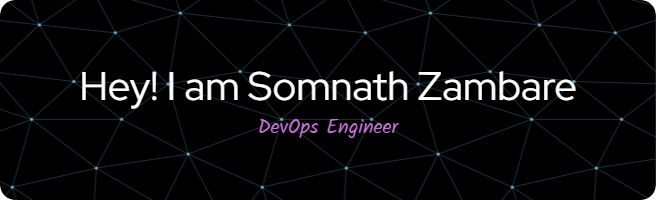

 

  
  

Welcome to my GitHub profile! I'm a passionate DevOps engineer with a strong background in cloud technologies and automation. I enjoy building scalable and resilient systems and also enjoy designing and implementing efficient CI/CD pipeline that empower teams to deliver software faster and more efficiently. Here you'll find some of my projects, contributions, and open-source work.

### Tech Stack

### 🔧 Technologies and Tools

- **Cloud**: AWS
- **CI/CD**: Jenkins
- **Infrastructure Provisioning Tool**: Terraform
- **Configuration Management**: Ansible
- **Containerization**: Docker, Kubernetes
- **Monitoring**: Prometheus, Grafana
- **Scripting**: Bash
- **Version Control**: Git, GitHub
- **Operating System**: Linux
- **Static Code Analysis**: SonarQube
- **Code Build and Artifact Generator**: Maven
- **Artifact Repository**: Nexus
- **Version Control**: Git, GitHub
- **Deployment Server**: Nginx, Apache Tomcat

### 🌱 I'm currently Working 

- Senior Systems Engineer, Infosys Limited | March 2022 - Present

### 📫 How to reach me

- LinkedIn - https://www.linkedin.com/in/somnath-zambare
- Gmail    - "somnathgzambare11@gmail.com"

### 🏆 Certifications

- AWS Certified Cloud Practioner
- Infosys Certified: Terraform Associate
- Infosys Certified AWS Developer Associate
- Infosys Certified Agile Global Developer

### 🏆 Honours And Awards

- Infosys Rise Insta Award

